# Sudoku Game
This is a simple Sudoku game implemented as a Command Line Interface (CLI)  project using Python. It allows users to play Sudoku interactively by entering their guesses for empty cells. The game also provides a solver that uses a backtracking algorithm to solve the Sudoku puzzle.

The objective is to fill a 9×9 grid (where empty cells are denoted by 0) with digits so that each column, each row, and each of the nine 3×3 subgrids that compose the grid contain all of the digits from 1 to 9.

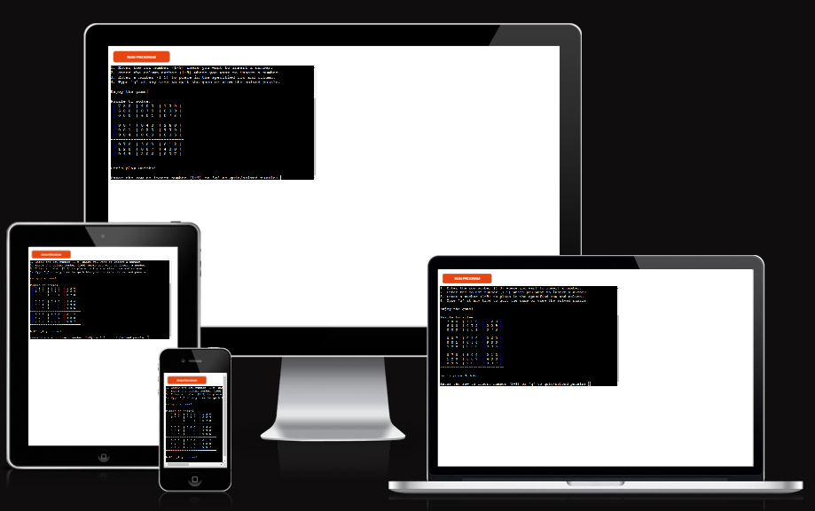

The live version of the project can be viewed [here](https://sudoku-game-0aaffdda0fa8.herokuapp.com/)

## Table of contents

## UX
### Site Goal
- Creating a fun and easy platform for Sudoku lovers to play and solve puzzles, whether they prefer manual solving or automatic solutions, with clear instructions and simple controls.

### User Stories
-	As a Sudoku enthusiast, I want to be able to solve Sudoku puzzles efficiently.
-	As a beginner in Sudoku, I want to play Sudoku interactively to improve my skills.
-	As a user, I want clear instructions on how to use the Sudoku solver and play the game.

### User Goals
-	Solve Sudoku puzzles quickly and accurately.
-	Enjoy playing Sudoku in an interactive manner.
-	Understand the rules of Sudoku and how to use the solver effectively.

##  Design

###  Flowchart

I used [draw.io](http://www.draw.io/) to make flow charts while working on this project. They helped me to plan the project and structure the code.

##  Application Features
- 	This is a command-line interface (CLI) application without GUI functionality.
### Python Logic
-	Implementation of a Sudoku board class using Object-Oriented Programming (OOP) concepts, encapsulating the board and its operations within a class structure.
-	Utilization of class methods for solving Sudoku puzzles, finding empty cells, and validating guesses.
-	Object-oriented design principles applied for modularity, encapsulation, and code reusability.

### Features of Sudoku game
-   **Welcome Message and Game Information:**
    -	Upon launching the program, users are greeted with a friendly welcome message.
    -	The welcome message provides an overview of the Sudoku game and its functionalities.
    -	Users are informed about the options to play Sudoku interactively or solve a given puzzle automatically.

        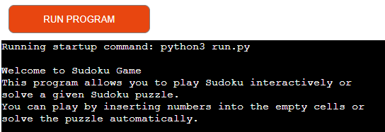

-   **Informative Instructions:**
    -	The program provides clear and concise instructions for users on how to play the Sudoku game interactively.
    -	Users are guided on how to input row numbers, column numbers, and numbers to place in the grid.
    -	Additionally, users are informed about how to quit the game or view the solved puzzle at any time.

        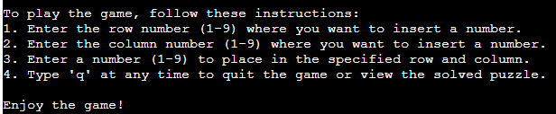

-   **Sudoku Puzzle Provided:**
    -	The program offers a pre-defined Sudoku puzzle to solve or play interactively.

        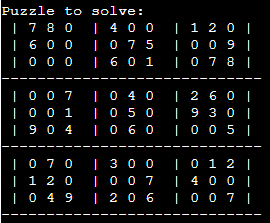

-   **Readable Output:**
    -	The Sudoku board is printed in a visually formatted manner, making it easy for users to read and understand.
    -	Rows and columns are separated by '|' and horizontal dividers are added after every third row.

        

-   **Interactive Sudoku Game:**
    -	Users can interactively play Sudoku by entering their guesses for empty cells.
    -	The game provides a user-friendly interface for inputting numbers into the Sudoku grid.

        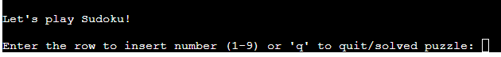

        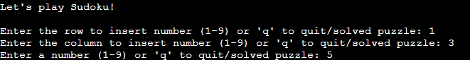

    -	After inserting a row, column, and number in the grid, the updated game is printed, allowing users to see the state of the puzzle after each move.

        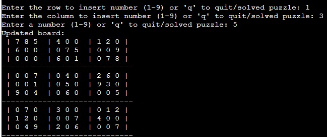

    -	Users can quit the game at any time or view the solved puzzle.

        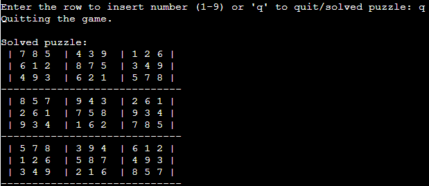

-   **Input Validation:**
    -	The program ensures that user inputs are only within the range of 1 to 9 for row numbers, column numbers, and guessed numbers.

        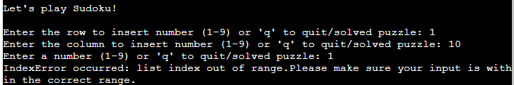

        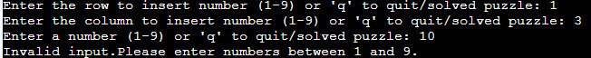

    -	It checks for valid inputs within the range of 1 to 9 and ensures that guessed numbers adhere to Sudoku rules.

        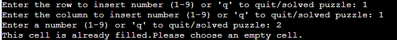

-   **Sudoku Solver:**
    -	The program provides a Sudoku solver based on backtracking algorithm.
    -	It efficiently solves Sudoku puzzles of varying difficulties.
    -	If a given puzzle is solvable, it guarantees a solution.
    -	Users can insert ‘q’ to view the solved puzzle.

        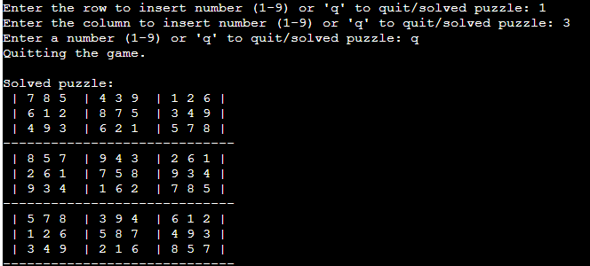  

-   **Error Handling:**
    -	Errors such as index out of bounds, invalid inputs are caught and appropriately handled.

        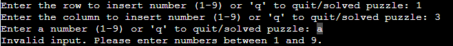 

         

         

## Future Features
-	Integration with a graphical user interface (GUI) for a more visually appealing gameplay experience.
-	Ability to generate random Sudoku puzzles of varying difficulty levels.

## Technologies Used

- **Git** Used to version control throughout my project and to ensure that a clean record is maintained.
- **GitHub**  Used to store the project's code after being pushed from Git
- **Heroku** Used to deploy the live project
- **GitPod** Used as an Integrated Development Environment for building this website.
- **<a href="http://www.draw.io">Draw.io</a>** Used for flow charts.
- **<a href="https://pep8ci.herokuapp.com/">CI Python Linter</a>** Used for validation
- **<a href="https://pypi.org/project/black/ ">Python Black Package</a>** Used for formating the code, which is python code formatter compliant with Pep8 guidelines

**Languages Used**
- Python

## Testing

### Validations
Used [CI Python Linter](https://pep8ci.herokuapp.com/) to validate the Python file follow the PEP8 style guide.

No errors were found.

## Deployment

This project is deployed on Heroku.

1. Login to [Heroku](https://id.heroku.com/login) or create a account.
2. On Dashboard of Heroku, click the button labeled as "New" and from the drop-down menu select "Create New App".
3. Please enter a unique app name.
4. Select your region and click on "Create App" button.
5. Within your page, navigate to "Settings" tab.
6. Scroll down to view the "Config Vars" section and click "Reveal Config Vars".
7. Add a Config Var with key "PORT" and value "8000".
8. Next, scroll down to "Buildpacks" sections. Click "Add buildpack", select "python", and click "Add buildpack".
9. Within the same section, Click "Add buildpack", select "nodejs", and click "Add buildpack".

    Note: Make sure that the python buildpack is before the nodejs buildpack. If not, you can reorder them by dragging python to the top.

10. Scroll up and Go to the "Deploy" tab.
11. Scroll down to "Deployment method" and select "GitHub" as the deployment method.
12. Search for the repository name and click "Connect" once you have found it.
13. Scroll to the bottom of the deploy page and select the preferred deployment type.
14. Click either Enable Automatic Deploys for automatic deployment when you push updates to Github or Manual deploy to deploy the current state of the branch you choose. I have first used the manual method and then changed it to Automatic Deploys.
15. Once the build is complete, click "View" to be taken to your deployed app.

## Credits
### Content and resources

1. Code Used
    - I used [this You Tube tutorial](https://www.youtube.com/watch?v=eqUwSA0xI-s&t=871s) to gather inspiration and ideas for developing the Sudoku game app.
    - I used [this You Tube tutorial](https://www.youtube.com/watch?v=lK4N8E6uNr4) to understanding Backtracking algorithm to find a solution to any solvable sudoku board.
2. Code Institute
	- Course content for the portfolio project3 helped greatly in understanding the need to complete the project.
	- The Love Sandwich project helped me understand various requirements from python point of view.
3. W3 School
	- Used to reference python related object oriented programming concepts and methods.
4. stackoverflow
	- Used to refer some python related workaround.
5. Draw.io
	- Used to create a flow chart to illustrate my project idea.
6. CI Python Linter
	- Used for validation to ensure cleaner, more consistent code and to improve the overall quality of software projects.
7. Python Black Package
	- Used to automatically format Python code according to a standardized style, enhancing code readability and maintainability.
8. Freecodecamp youtube channel
    - Used to understand Usecase of `if __name__ == "__main__":` block for code modularity and reusability
    - Used to reference python related object oriented programming concepts

### Acknowledgements
I would like to acknowledge:

Mentor - Jubril Akolade
- My Mentor provided feedback and guidance throughout.

Kay - Cohort facilitator
- She was very helpful in making me understand the various requirements to achieve a good project.