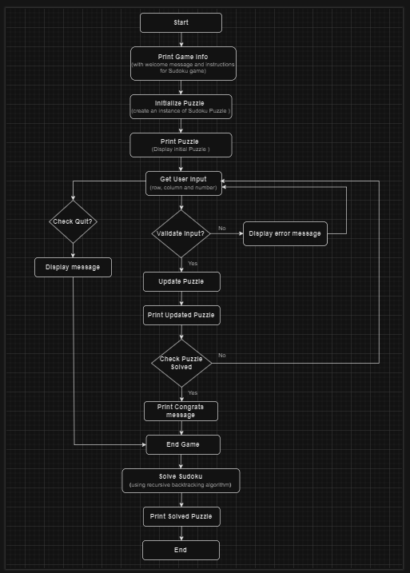
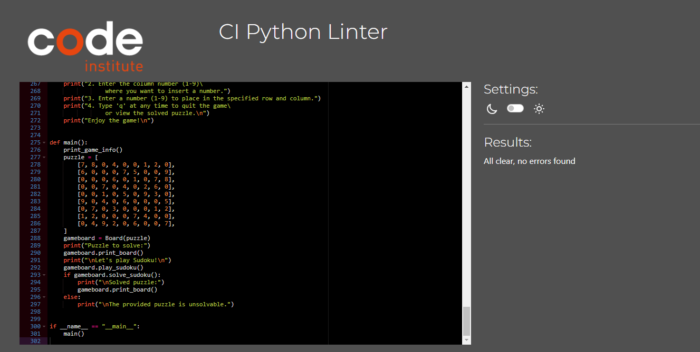

# Sudoku Game
This is a simple Sudoku game implemented as a Command Line Interface (CLI)  project using Python. It allows users to play Sudoku interactively by entering their guesses for empty cells. The game also provides a solver that uses a backtracking algorithm to solve the Sudoku puzzle.

The objective is to fill a 9×9 grid (where empty cells are denoted by 0) with digits so that each column, each row, and each of the nine 3×3 subgrids that compose the grid contain all of the digits from 1 to 9.

The live version of the project can be viewed [here](https://sudoku-game-0aaffdda0fa8.herokuapp.com/)

## Table of contents

## UX
### Site Goal
- Creating a fun and easy platform for Sudoku lovers to play and solve puzzles, whether they prefer manual solving or automatic solutions, with clear instructions and simple controls.

### User Stories
-	As a Sudoku enthusiast, I want to be able to solve Sudoku puzzles efficiently.
-	As a beginner in Sudoku, I want to play Sudoku interactively to improve my skills.
-	As a user, I want clear instructions on how to use the Sudoku solver and play the game.

### User Goals
-	Solve Sudoku puzzles quickly and accurately.
-	Enjoy playing Sudoku in an interactive manner.
-	Understand the rules of Sudoku and how to use the solver effectively.

##  Design

###  Flowchart

I used [draw.io](http://www.draw.io/) to make flow charts while working on this project. They helped me to plan the project and structure the code.

##  Application Features
- 	This is a command-line interface (CLI) application without GUI functionality.
### Python Logic
-	Implementation of a Sudoku board class using Object-Oriented Programming (OOP) concepts, encapsulating the board and its operations within a class structure.
-	Utilization of class methods for solving Sudoku puzzles, finding empty cells, and validating guesses.
-	Object-oriented design principles applied for modularity, encapsulation, and code reusability.

## Future Features
-	Integration with a graphical user interface (GUI) for a more visually appealing gameplay experience.
-	Ability to generate random Sudoku puzzles of varying difficulty levels.

## Testing

### Validations
Used [CI Python Linter](https://pep8ci.herokuapp.com/) to validate the Python file follow the PEP8 style guide.

No errors were found.

